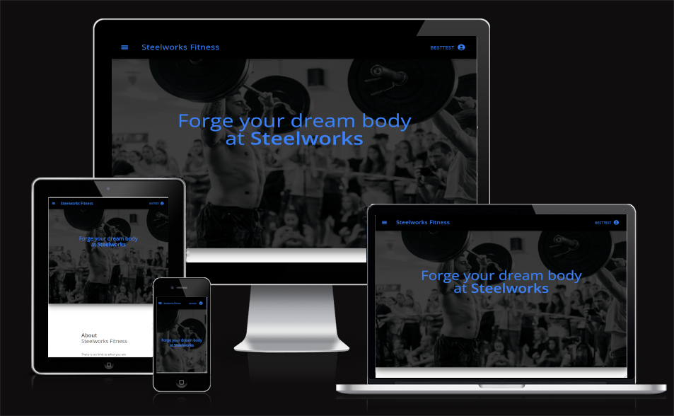

# Steelworks fitness

Fullstack eCommerce Gym website. React frontend and Django restframework backend with postgresql database.

## User Experience (UX)

- ### User stories

  - #### First Time Visitor Goals

    1. As a First Time Visitor, I want to easily ....
    2. As a First Time Visitor, I want to be able to easily ...
    3. As a First Time Visitor, I want to be able to easily ....

  - #### Returning Visitor Goals

    1. As a Returning Visitor, I want to be able to ...
    2. As a Returning Visitor, I want to be able to ...
    3. As a Returning Visitor, I want to find contact information.

- ### Design
  - #### Colour Scheme
    - The main colour used throughout is ...
  - #### Typography
    - The Amatic SC font is the main font used throughout the .... and why...
  - #### Imagery
    - Imagery used to make up ...
  - #### Wireframe
    - This wireframe was used initially to get an idea of the style and layout of the page would be:
      [Wireframe Screenshot](./assets/media/ci-5-steelworks.png)

## FEATURES

### EXISTING FEATURES

- **Feature**

  - description

  

## Technologies Used

### Languages Used

- [HTML5](https://en.wikipedia.org/wiki/HTML5)
- [CSS3](https://en.wikipedia.org/wiki/Cascading_Style_Sheets)
- [JavaScript](https://en.wikipedia.org/wiki/JavaScript)

### Frameworks, Libraries & Programs Used

1. [Google Fonts:](https://fonts.google.com/)
   - Google fonts were used to import the 'Amatic SC' font into the style.css file which is used in all text on the page.
1. [Font Awesome:](https://fontawesome.com/)
   - Font Awesome was used to add audio on and off icons.
1. [Git](https://git-scm.com/)
   - Git was used for version control by utilizing the Gitpod terminal to commit to Git and Push to GitHub.
1. [GitHub:](https://github.com/)
   - GitHub is used to store the projects code after being pushed from Git.
1. [GIMP:](https://www.gimp.org/)
   - GIMP was used for resizing images and for creating the games drawings of the letter underscores, stickman, gallows, and border.

### FUTURE FEATURES

## TESTING

### Testing User Stories from User Experience (UX) Section

- #### First Time Visitor Goals

  1. As a First Time Visitor, I want to easily ...
     1. Solution
     2. Solution
     3. Solution
  2. As a First Time Visitor, I want to easily ...
     1. Solution
     2. Solution
     3. Solution

- #### Returning Visitor Goals

  1. As a Returning Visitor, I want to ...
     1. Solution
     2. Solution

### Known Bugs

#### Solved Bugs

### Further Testing

- The Website was tested on Google Chrome, Firefox, Microsoft Edge, Brave Browser, Ecosia and Safari.
- The website was viewed on a variety of devices such as Desktop, Laptop, Samsung S9, S10, iPhone X.
- Friends and family members were asked to review the site and documentation to point out any bugs and/or user experience issues.

### Validator Testing

- HTML
  - No errors were returned when passing through the official W3C validator.
     validator.
    
- Accessibility

  - I confirm that the colours and fonts are easy to read and accessible by running it through the lighthouse in devtools.

  

## Deployment

- Local deployment was achieved with with Python from the console. The game was  
  developed on a Ubuntu OS and so was already installed. Steps are as follows:

  - Run `python3 run.py` in the terminal with root directory of the project.

- Heroku Deployment:
  - Create a new Heroku app.
  - Set the build packs to `Python` and `NodeJS` in that order.
  - Set Config Vars key value pairs for:
    1. `PORT`: `8000`
    1. `CREDS`: `{CREDS Object}` where {CREDS Object} is from the credentials file
       dowoloaded from Google Cloud Platform.
  - Enter `heroku login -i` command in the terminal with root directory of the project.
  - Enter Heroku username and password.
  - Enter `git push --set-upstream https://git.heroku.com/ci-4-blugold.git` to deploy.
  - Enter `git push --set-upstream https://github.com/RobTheThief/ci-4-blugold.git main` to reset upstream to github.

The live link can be found here - https://ci-4-blugold.git.herokuapp.com/

## Credits

### Content

### Media
