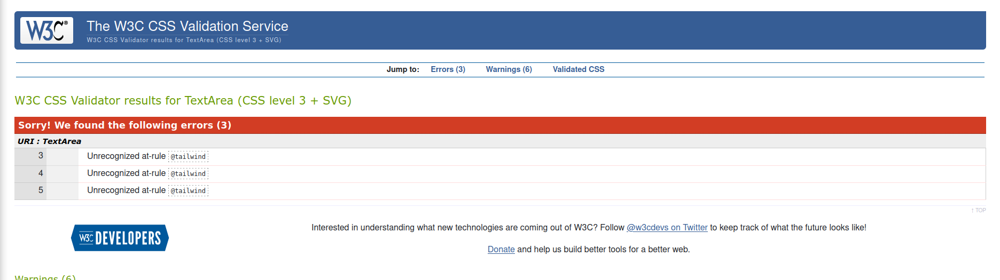
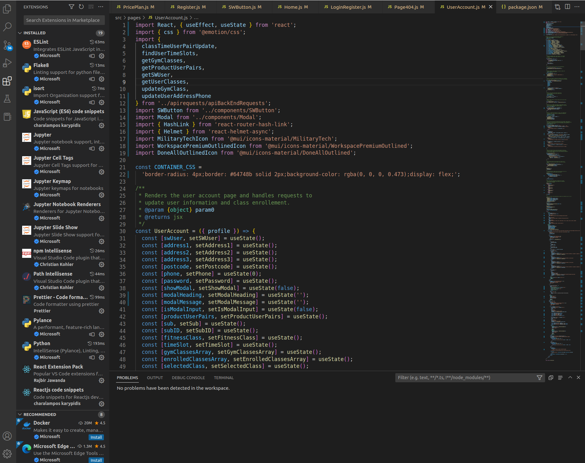

# Steelworks fitness

Fullstack eCommerce Gym website. React frontend and Django restframework backend with postgresql database.

## User Experience (UX)

- ### User stories

  - #### First Time Visitor Goals

    1. As a First Time Visitor, I want to easily understand the purpose of the site.
    2. As a First Time Visitor, I want to be able to easily see the different gym plans and the differences between them.
    3. As a First Time Visitor, I want to be able to easily register as a new user and log in.
    4. As a First Time Visitor, I want to be able to easily see what classes are available.

  - #### Returning Visitor Goals

    1. As a Returning Visitor, I want to be able to log in and see my account details and subscription.
    2. As a Returning Visitor, I want to be able to upgrade my subscription.
    3. As a Returning Visitor, I want to find contact information.

- ### Design
  - #### Colour Scheme
    - The main colour used throughout is black, blue (#3b82f6) and slate (#64748b).
  - #### Typography
    - The Open Sans font is the main font used throughout the UI with sans-serif as the fallback font in case the font isn't being imported into the site correctly. They are used because they are easy to read and have a neutral and friendly appearance.
  - #### Imagery
    - Imagery used was from Unsplash and the favicon was made using [GIMP](https://www.gimp.org/). THe 404 Error gif was from [Giphy](https://giphy.com)
  - #### Wireframe
    - This wireframe was used initially to get an idea of the style and layout of the site would be:
      
  - #### Relational model diagram
    - This diagram was used to plan how the database tables would relate to each other and what data they should contain:
      

## FEATURES

### EXISTING FEATURES

- **Page Layout**

  - A single layout is used for all pages on the site. It consists of:
    1. A navbar with user options for login/register, logout or got to account.
    1. A sidebar that links to each section of the home page.
    1. A footer with a Facebook page link.

  
  
  

- **Hero section**

  - The main hero sections greets the user with an inviting image of 2 people working out in a ring and a motivational message overlaid.
    

- **About section**

  - The about section gives a description form the owner and a testimonial from a happy customer.
    

- **Price Plan section**

  - This section has each subscription price plan with the features and drawbacks of each plan.
  - There is a checkout form modal for Stripe payments that opens when the 'Sign up' button is clicked.
    
    

- **Contact section**

  - Contact section has a form to send an email with the contact information to the product owner using [Formspree](https://formspree.io/).
  - There is also a newsletter sign up form which is handles by [Mailchimp](https://mailchimp.com/).
    

- **Login/Register page**

  - Login/register page shows a component for either login or register (login by default).
  - User can switch between login or register by way of the link by the submit button.
    User input is checked and a modal with warnings or error is shown if incorrect.
    
    
    

- **Account page**
  - In the account page you can: 1. View and update user information. 1. View current subscription. 1. Choose classes to enroll or drop out of. 1. Get information about the classes.
    

## Technologies Used

### Languages Used

- [HTML5](https://en.wikipedia.org/wiki/HTML5)
- [CSS3](https://en.wikipedia.org/wiki/Cascading_Style_Sheets)
- [JavaScript](https://en.wikipedia.org/wiki/JavaScript)
- [Python](<https://en.wikipedia.org/wiki/Python_(programming_language)>)

### Frameworks, Libraries & Programs Used

1. [Google Fonts:](https://fonts.google.com/)
   - Google fonts were used to import the 'Open Sans' font into the App.css file which is used in all text on the site.
1. [Git](https://git-scm.com/)
   - Git was used for version control by utilizing the Gitpod terminal to commit to Git and Push to GitHub.
1. [GitHub:](https://github.com/)
   - GitHub is used to store the projects code after being pushed from Git.
1. [GIMP:](https://www.gimp.org/)
   - GIMP was used for resizing images and for creating the favicon.
1. [Balsamiq](https://balsamiq.com/)
   - Was used to create the wireframe for the UI.
1. [Django](https://www.djangoproject.com/)
   - Django was used in the backend to serve the React frontend for the application.
1. [Django Rest Framework](https://www.django-rest-framework.org/)
   - Django Rest Framework was used to create the Rest API to make requests to the Postgresql database as well as middleware to make requests to the Stripe API. Its was also used for the authentication, authorization and permissions.
1. [Postgresql](https://www.postgresql.org/)
   - Postgresql was used for the site database.
1. [React](https://reactjs.org/)
   - The React library was used to create the frontend.
1. [Material UI](https://mui.com/)
   - MUI was used for many of the UI components such as the layout and buttons. MUI Icons was also used for all icons used on this site.
1. [TailWindCSS](https://tailwindcss.com/)
   - TailWindCSS css framework was used for most of the component styling.
1. [Emotion](https://emotion.sh/)
   - Emotion was used where inline styling was required and was chosen as it works well with MUI.
1. [React router](https://reactrouter.com/)
   - React router was used to handle the routes for the front end.
1. [React Helmet async](https://www.npmjs.com/package/react-helmet-async)
   - React helmet async was used to add a head to each page so that page title and meta tags could be set.
1. [React Stripe js](https://stripe.com/docs/stripe-js/react)
   - React Stripe js was used to create the checkout form and make a stripe payment.
1. [Formspree](https://formspree.io/)
   - Formspree was used to handle the contact form submission and send an email with the contact information to the product owner.
1. [Mailchimp](https://mailchimp.com/)
   - Mailchimp is used to handle form submission for a news letter to create a list of user emails that would like to subscribe to our mailing list.

### Marketing

This business model is that of a gym with fitness equipment as well as trainers and a pool. They would expect to get clients from ages 18 to 54 ([gymdesk.com](https://gymdesk.com/blog/gym-membership-statistics/)). They would hope to get traffic from Facebook, google search results, and by advertising through a mailing list.

- A Facebook page was set up for [Steelworks fitness](https://www.facebook.com/people/Steelworks-Fitness/100088910285306/). And this was added as a link in the footer of the layout with the Facebook icon.
  
- A newsletter mailing list sign up form was added to the contact section using the [Mailchimp](https://mailchimp.com/) service.
- SEO guidelines were followed using semantic HTML and appropriate use of meta tags utilizing react-helmet-async.

### FUTURE FEATURES

- Admin section tailored for when a Steelworks staff member logs in and can make CRUD operations on the database. Currently the staff member or developer will need to log in as an admin member and make the changes through the Django UI.

## TESTING

### Testing User Stories from User Experience (UX) Section

- #### First Time Visitor Goals

  1. As a First Time Visitor, I want to easily understand the purpose of the site.
     1. On the nav bar the name of the business 'Steelworks fitness' is shown.
     2. The hero image show 2 people exercising.
     3. There is an about section under the hero section that is also linked in the sidebar menu that explains the kind of facilities the gym has.
  2. As a First Time Visitor, I want to be able to easily see the different gym plans and the differences between them.
     1. There is a Price plan section under the about section that is also linked in the sidebar menu.
     2. It shows the differences between each price plan including the cost.
  3. As a First Time Visitor, I want to be able to easily register as a new user and log in.
     1. On the nav bar there is a 'LOGIN/REGISTER' button next to the user icon. Clicking on any of these will bring you to the login/register page.
     2. On the login/register page the login component is shown with an option to register.
  4. As a First Time Visitor, I want to be able to easily see what classes are available.
     1. There is a message on the sign up button to login to sign up and see classes.
     2. After logging in you can see the different classes with a description and times they are on.

- #### Returning Visitor Goals

  1. As a Returning Visitor, I want to be able to log in and see my account details and subscription.
     1. On the nav bar there is a 'LOGIN/REGISTER' button next to the user icon. Clicking on any of these will bring you to the login/register page.
  2. As a Returning Visitor, I want to be able to upgrade my subscription.
     1. You can upgrade by going to the price plan on tha home page. It will not let you downgrade or re subscribe to the same plan.
     2. There is an upgrade button on the account page that links to the price plan section on the home page.
  3. As a Returning Visitor, I want to find contact information.
     1. At the bottom of the home page and linked from the sidebar menu is the contact section.
     2. You can submit a query with you email address.
     3. THere is also a newsletter sign up form in the contact section to be added to a mailing list.

## Manual Testing

| Test                                                                                                        | Expected outcome                                                                                                                                                                                                                                                                                                                                                                                                                                                                                                                                                                                                  | Actual outcome |
| ----------------------------------------------------------------------------------------------------------- | ----------------------------------------------------------------------------------------------------------------------------------------------------------------------------------------------------------------------------------------------------------------------------------------------------------------------------------------------------------------------------------------------------------------------------------------------------------------------------------------------------------------------------------------------------------------------------------------------------------------- | -------------- |
| Login section responds appropriately for given input.                                                       | Login section will log in a registered user or give an error message if the details are incorrect. If the input is empty and login is clicked then the browser will prompt you to enter input.                                                                                                                                                                                                                                                                                                                                                                                                                    | As expected    |
| Register section should give appropriate feedback if incorrect input is used, or register and login if not. | If a username or email address has been used previously, or if the passwords do not match, or if the password is invalid an error message should be displayed to the user. If any of the fields is empty the browser should display a message to indicate that the field is required. The UI should log the user in automatically upon successful registration. Once logged in the logout, account menu should be displayed when the user clicks on the user icon in the nav bar and the account page should be displayed.                                                                                        | As expected    |
| Logout should operate as expected.                                                                          | Logout displays only when the user is authenticated and the session cookies are valid. Otherwise the login and registration section is shown when the user icon or 'LOGIN/REGISTER' button is clicked. The correct username is displayed and the logout button logs out the user displaying the login and registration page. When not logged in the user is no longer able to perform protected actions.                                                                                                                                                                                                          | As expected    |
| The price plan sign up button should operate as expected.                                                   | When the user is not logged in and clicks on the sign up button they should get a prompt to log in or register to sign up or view the classes. When logged in the user is shown a checkout modal with the subscription type and their email displayed. They should be able to enter credit card details with error messages being shown on the modal as they type and addition modals being shown if there are other errors or warnings to be shown upon submit. The user will be warned if they are upgrading, downgrading, or re subscribing.                                                                   | As expected    |
| Contact form submission.                                                                                    | There are 2 fields and both are required so if empty the browser will prompt the user to fill out if they click the submit button or if the email field does not have an email typed in. Upon submission a new tab will open from formspree informing the user of form submission success.                                                                                                                                                                                                                                                                                                                        | As expected    |
| Newsletter form submission.                                                                                 | Mailchimp handles the errors for this form. Upon submission there is a new tab opened showing either form submission success or displaying the appropriate errors.                                                                                                                                                                                                                                                                                                                                                                                                                                                | As expected    |
| User account details update.                                                                                | On the account page the user address and phone number can be updated by editing the information displayed in the inputs and clicking 'update'. If the phone is not a number the browser will display a message to match the requested format. Upon clicking 'update' a modal will open to enter the user password again. If it is incorrect a error modal will show. Otherwise it is updated.                                                                                                                                                                                                                     | As expected    |
| Active subscription section of user account.                                                                | In the accounts page there is an active subscription section that should show the correct plan with an icon or 'none'. There is an upgrade button that links to the Price plan section of the home page.                                                                                                                                                                                                                                                                                                                                                                                                          | As expected    |
| Class enrollment section of account page.                                                                   | When a class is selected it should show a description at the bottom of the section. When a class and time are chosen and enroll is clicked it should add that class to the appropriate part of the time slot section below. A warning modal should show if you are already enrolled. A warning modal should show if you have exceeded the number of classes allowed for your plan. A warning modal should show if you have not selected both a class and a slot. Time slot should be removed when 'remove' is clicked if the a class and slot are selected and it is a class previously enrolled in at that time. | As expected    |
| Navigation should work on all pages and display the correct information and behavior if logged in.          | Clicking on 'LOGIN/REGISTER' or user icon should bring you to the login page. When logged in 'LOGIN/REGISTER' should display the username instead. Clicking on the user name should bring you to the account page. Clicking on the user icon should show a drawer menu with option 'account', and 'Logout'. These buttons should log out or bring you to the account page. The side bar menu should link to each section of the home page and work from any page. The Facebook link in the footer should bring you to the Steelworks Facebook page in a new tab.                                                  | As expected    |

### Known Bugs

- There are no known remaining bugs.

#### Solved Bugs

- By not using a create-react-app project and configuring babel and webpack myself this left me with out a public folder to put my robots.txt and sitemap.xml into. After some researching I found that I could make a route in the backend for each of these if 'django.contrib.sitemaps' was also installed.

### Further Testing

- The site in an early stage of development was shown to a team of UX/UI designers and developers where I work to give feedback and test the site at that time.
- The Website was tested on Google Chrome, Firefox, Microsoft Edge, Brave Browser, Ecosia and Safari.
- The website was viewed on a variety of devices such as Desktop, Laptop, Samsung S9, S10, iPhone X.
- Friends and family members were asked to review the site and documentation to point out any bugs and/or user experience issues.

### Validator Testing

- Python
  - I can confirm that there are no errors after correcting all problems shown with the flake8 vscode extension.
    
- CSS
  - Only Unrecognized at-rule error was shown when passing through the official(Jigsaw) validator. This is the way TailWindCSS instructs on how to setup Tailwind so is being ignored.
    
- ESLint
  - I can confirm that there are no errors after correcting all problems shown with the ESLint vscode extension.
  - 
- Accessibility

  - I confirm that the colours and fonts are easy to read and accessible by running it through the lighthouse in devtools.

  

## Deployment

- Steps for local deploy during development:

  - in the project root directory terminal enter:
    - python manage.py runserver
    - npm run dev - to run webpack in development mode for the frontend

- Heroku Deployment:

  - Create a new Heroku app.
  - Set the build packs to `Python` and `NodeJS` in that order.
  - Set up postgresql database using heroku addons:create heroku-postgresql:hobby-dev
  - Set Config Vars key value pairs for:

    1. `ALLOWED_HOSTS`: `APP_NAME.herokuapp.com`
    1. `DATABASE_URL`: `DATABASE URL HERE`
    1. `DB_PASSWORD`: `YOUR DB PASSWORD`
    1. `DJANGO_SECRET_KEY`: `YOUR SECRET KEY`
    1. `REACT_STRIPE_GOLD_ID`: `STRIPE PRODUCT ID HERE`
    1. `REACT_STRIPE_SILVER_ID`: `STRIPE PRODUCT ID HERE`
    1. `REACT_STRIPE_UNLIMITED_ID`: `STRIPE PRODUCT ID HERE`
    1. `REACT_STRIPE_PUBLISHABLE_KEY`: `YOUR KEY HERE`
    1. `REACT_STRIPE_SECRET_KEY`: `YOUR KEY HERE`
    1. `WEB_CONCURRENCY`: `1`

  - Enter `heroku login -i` command in the terminal with root directory of the project.
  - Enter Heroku username and password.
  - Enter `git push --set-upstream https://git.heroku.com/steelworks-ci-5.git` to deploy.
  - Enter `git push --set-upstream https://github.com/RobTheThief/steelworks-ci-5.git main` to reset upstream to github.

The live link can be found here - https://steelworks-fitness.herokuapp.com/

## Credits

### Media

All icons used were form Material UI Icons [Material UI Icons](https://mui.com/material-ui/material-icons/#main-content).

All other images except the favicon came from [Unsplash](https://unsplash.com) stock photos. The 404 gif came from [Giphy](https://giphy.com/).
